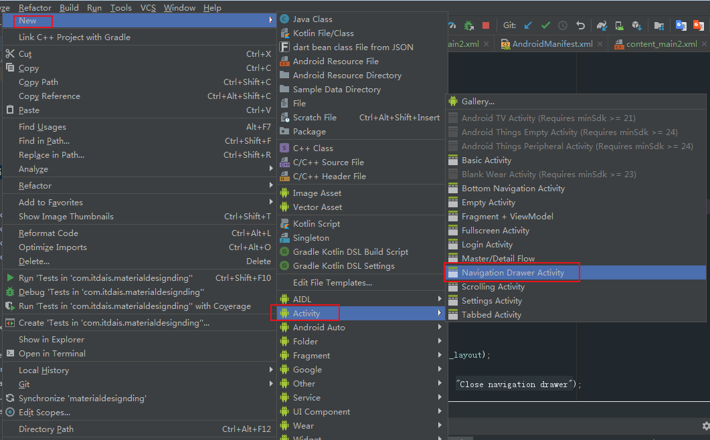
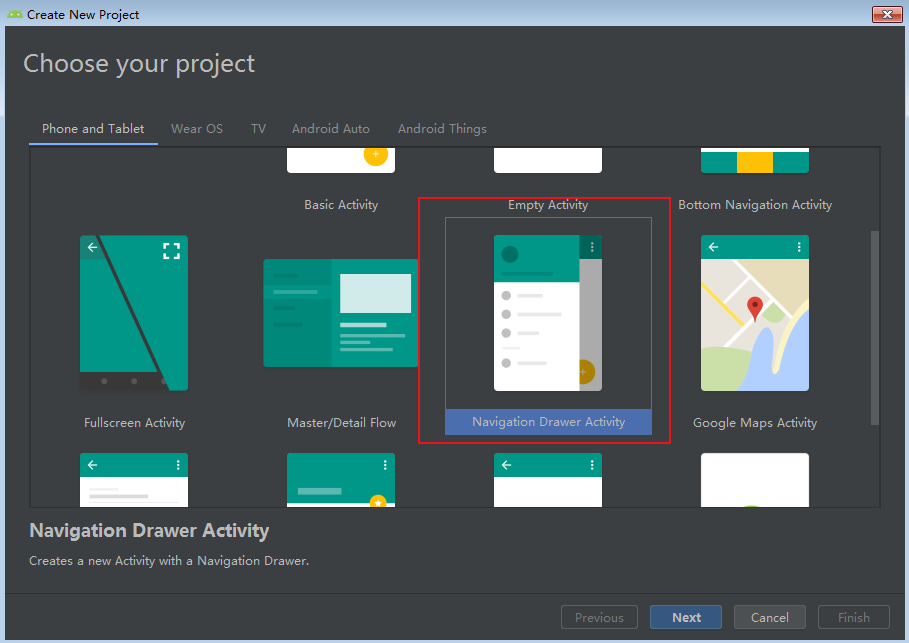

# AndroidX 

[android之androidx转换](https://blog.csdn.net/sinat_31057219/article/details/90247278)

包名需要修改，部分如下：

``` 
androidx.annotation.Nullable;
androidx.appcompat.app.AppCompatActivity;

com.google.android.material.floatingactionbutton.FloatingActionButton;
com.google.android.material.navigation.NavigationView;
com.google.android.material.snackbar.Snackbar;

androidx.appcompat.app.ActionBarDrawerToggle;
androidx.appcompat.widget.Toolbar;
androidx.core.view.GravityCompat;
androidx.drawerlayout.widget.DrawerLayout;
```

# DrawerLayout 

我们可以新建 DrawerLayout 的application或者 DrawerLayout 的activity 的示例。

如图：





参考：

[DrawerLayout 和 NavigationView 使用详解](https://juejin.im/entry/58b78a64a22b9d005ecd8f97)

[itdais/MaterialDesignDing ： BottomSheets、DrawerLayout示例](https://github.com/itdais/MaterialDesignDing)

[MaterialDesign系列文章（二）NavigationView和DrawerLayout实现侧滑功能](https://juejin.im/post/5adddf206fb9a07a9c03d572)


